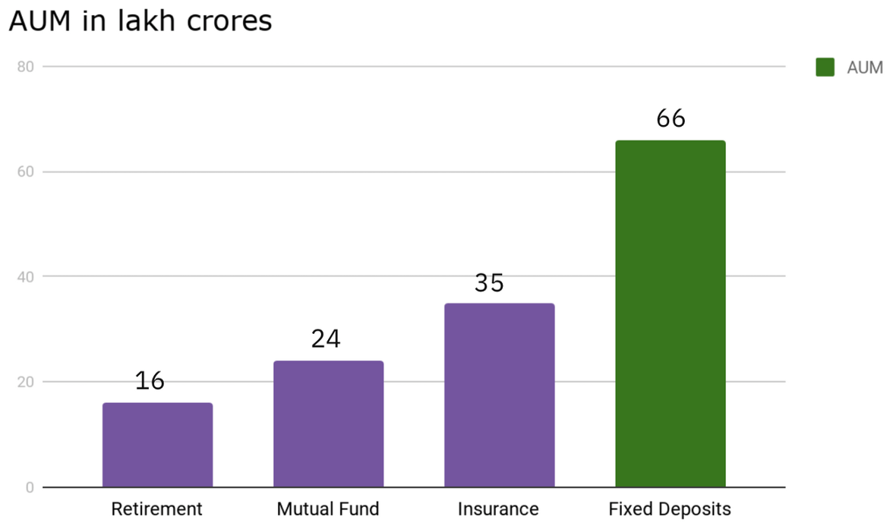
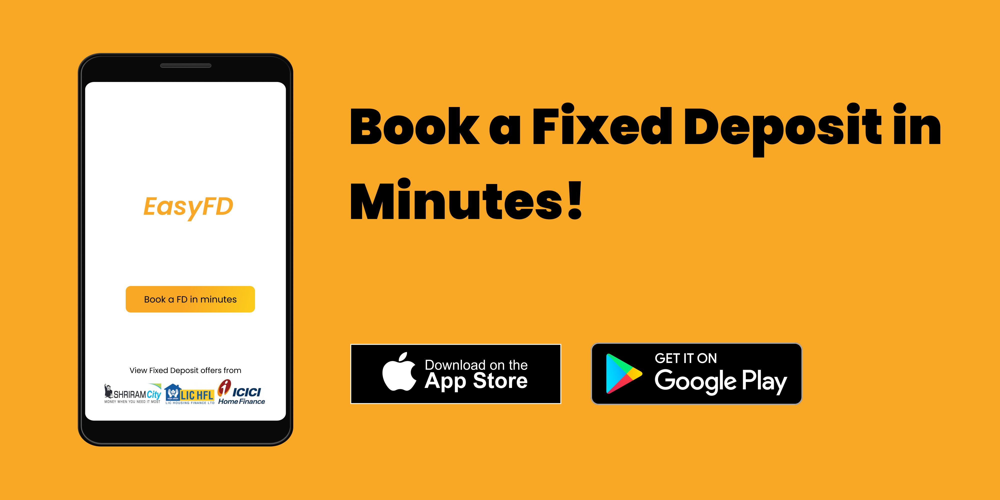

# EasyFD - Reimagining fixed deposits for India
\\
Sometime last year, I opened a fixed deposit to stash some of my savings with my bank and had this thought : 
interest rates have hit record lows, considering inflation and taxes - fixed deposits are a losing proposition. 
Then I read about corporate FDs that were offering 8+% interest rates (not without the risks though), but there was no simple way to book them - there was a lot of paperwork required and the hassle didn't seem worth it.

After some googling, I stumbled upon D91 labs' [article](https://medium.com/91-labs/india-%EF%B8%8Fs-f-d-and-they-need-a-digital-makeover-95906fd00cec) on the need digital make over of fixed deposits which offered a lot of insights on Fixed Deposits in India.

### The Fixed Deposit is India's favorite savings product 

The humble fixed deposit has been the favorite savings product for a majority of Indians, which offers risk-free, guaranteed returns. For most Indians that had a bank account, opening a FD is simple and hassle free.

In terms of AUM (Assets Under Management), fixed deposits trump other products like Mutual Funds, Insurance by a huge margin. 

|  | 
|:--:| 
| *Total Assets Under Management for different products. Image courtesy of D91 labs.* |

Therefore, it would seem that the FD booking space is ripe for disruption - players like [PayTM Money](https://timesofindia.indiatimes.com/business/india-business/paytm-allocates-100m-for-wealth-mangement-biz-eyes-profitability/articleshow/80253621.cms) have plans to enable users to invest in FDs soon.

### Bank FDs vs Corporate FDs

Bank FDs have been the norm, but in recent years with falling interest rates, corporate FDs are getting popular with investors. Corporate FDs are typically issued by private and state-owned NBFCs like LIC Housing Finance, Shriram Transport Finance and Kerala Transport Development Finance Corporation. Companies like Hawkins Cooker Ltd. have also offered FDs for retail investors. 

Unlike Bank FDs which are protected by deposit insurance (to a certain limit), corporate FDs come with significant credit risk. Corporate FDs are typically unsecured, which means that if the company's financial position weakens the deposits are a risk. Credit rating agencies like CRISIL and CARE Ratings mostly rate secured
debt of companies (such as NCDs or Senior Notes) and not the FDs, so going by the credit ratings might not be entirely reliable to make an investment decision.
 

### Challenges involved in offering a platform to invest in Fixed Deposits 

Offering fixed deposit investments as a platform comes with a lot of challenges : 

- **Account requirement** : Most banks require people to open a savings account in order to open a fixed deposit.  Opening a savings account means keeping track of minimum balance requirements and parking funds in the savings account as well. 
- **Lack of uniform processes for opening** : Banks have their own processes for KYC etc. and corporates that offer FDs have their own processes. An umbrella body like the AMFI for the mutual fund industry is needed to bring these entities together and setup a uniform process for issuing fixed deposits.
- **Lack of APIs** : The mutual funds industry has simple, ready to consume APIs for fintech players to distribute MFs. This has led to the growth of apps like Kuvera, PayTM Money, Groww etc. that offer investments as a service. For FDs, an umbrella body needs to be setup to produce a set of standard APIs.
- **Business model considerations** : The mutual fund industry's growth can be attributed to the wide distributor driven,  commission-based model. There's no economic incentive like that for FDs.

### Enter EasyFD - a concept app for booking FDs

I thought, why not conceptualise an app exclusively (at least at the moment!) for making fixed deposit investments in banks as well as corporations. I fired up Figma and whipped up a few prototype screens to visualize the user journey. Obviously, a lot of things have been simplified (see challenges listed above), but the idea was to envision an app to make fixed deposit investments effortlessly.

Checkout the whole project on my Behance [here](https://www.behance.net/gallery/111635803/EasyFD-A-concept-fixed-deposit-booking-app)! 

